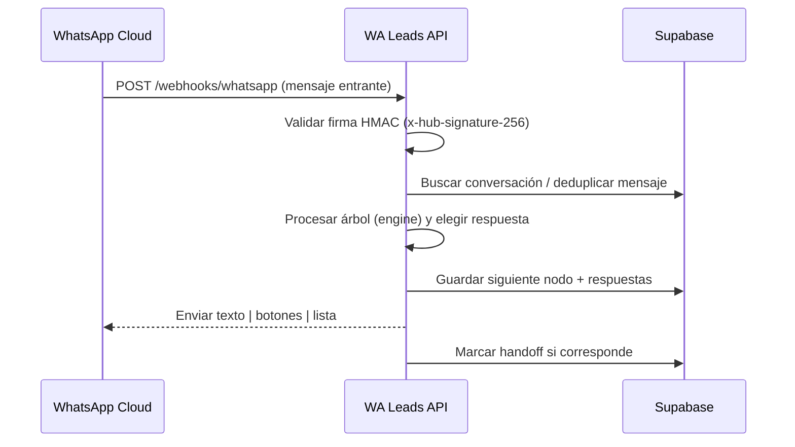

# WA Leads API

[](https://nodejs.org/)
[](https://www.typescriptlang.org/)
[](https://expressjs.com/)
[](https://developers.facebook.com/docs/whatsapp)

API/worker para automatizar la captura de leads vía WhatsApp Cloud, persistir la conversación y despachar respuestas (texto, botones y listas).

---

## 👀 Visión rápida



Estructura del árbol conversacional (simplificada):

```text
start (texto) -> list/buttons -> next -> ... -> end (handoff opcional)
```

## 🚀 Cómo correrlo

### Prerrequisitos

- Node.js 20+
- Cuenta y app de WhatsApp Cloud (token y verify token)
- Proyecto Supabase (url + service role key)

### Instalación

```bash
npm install
```

### Variables de entorno

| Variable | Descripción |
| --- | --- |
| `PORT` | Puerto del servidor (default 3000) |
| `LOG_LEVEL` | fatal \| error \| warn \| info \| debug \| trace \| silent |
| `WHATSAPP_VERIFY_TOKEN` | Token de verificación del webhook |
| `WHATSAPP_ACCESS_TOKEN` | Token de acceso de WhatsApp Cloud (fallback) |
| `WHATSAPP_GRAPH_VERSION` | Versión de la API (ej. v22.0) |
| `META_APP_SECRET` | Secreto para validar `x-hub-signature-256` |
| `SUPABASE_URL` | URL del proyecto Supabase |
| `SUPABASE_SERVICE_ROLE_KEY` | Service Role key de Supabase |

Coloca estas llaves en un `.env` (no se versiona).

### Desarrollo

```bash
npm run dev
```

Abre `http://localhost:3000/health` para revisar el estado.

### Build y lint

```bash
npm run build
npm run lint        # solo chequeo
npm run lint:fix    # con autofix
npm run format      # Prettier
```

### Docker

```bash
docker build -t wa-leads-api .
docker run -p 3000:3000 --env-file .env wa-leads-api
```

### Endpoints

- `GET /health` — simple healthcheck.
- `GET /webhooks/whatsapp` — handshake de verificación (meta).
- `POST /webhooks/whatsapp` — recibe mensajes entrantes, procesa y responde.

## 🧠 Arquitectura

- `src/routes/whatsapp.ts` — Webhook, validación de firma, deduplicación, handoff.
- `src/bot/engine.ts` — Motor de árbol conversacional.
- `src/bot/tree.ts` — Definición del flujo (texto, listas, botones, end).
- `src/repositories/*` — Persistencia (Supabase).
- `src/lib/waSend.ts` — Cliente WhatsApp Cloud (texto/lista/botones).
- `src/lib/slug.ts` — Generación de slugs únicos para leads.
- `src/config/env.ts` — Validación de configuración con Zod.
- `src/server.ts` — App Express + middlewares.

## 🌳 Personalizar el árbol de conversación

Edita `src/bot/tree.ts` para ajustar mensajes, opciones y el orden de nodos. Cada nodo puede:

- `type`: `text` | `list` | `buttons` | `end`
- `body`: texto a enviar
- `options`: para `list/buttons`, con `id`, `title`, `next`
- `saveAs`: clave para almacenar la respuesta en `answers`
- `next`: siguiente nodo (en nodos de texto)

## 🔐 Seguridad

- Valida HMAC `x-hub-signature-256` con `META_APP_SECRET`.
- Deduplicación de mensajes para evitar reenvíos.
- Handoff a humano cuando el nodo final lo marca.

## 🧪 Probando el webhook localmente

1. Usa `ngrok`/`cloudflared` para exponer `http://localhost:3000/webhooks/whatsapp`.
2. Configura ese URL en el dashboard de WhatsApp Cloud.
3. Envía mensajes de prueba desde tu número sandbox y revisa los logs.

## 📦 Despliegue en Render

- `render.yaml` incluye servicio web y variables/env.
- `Dockerfile` genera una imagen lista para producción.

---

¿Sugerencias o ajustes? Abre un issue o PR. ✨
