# WA Leads API

[](https://nodejs.org/)
[](https://www.typescriptlang.org/)
[](https://expressjs.com/)
[](https://developers.facebook.com/docs/whatsapp)

API/worker para automatizar la captura de leads vía WhatsApp Cloud, persistir la conversación y despachar respuestas (texto, botones y listas).

---

## 👀 Visión rápida

```mermaid
sequenceDiagram
  participant WA as WhatsApp Cloud
  participant API as WA Leads API
  participant DB as Supabase

  WA->>API: POST /webhooks/whatsapp (mensaje entrante)
  API->>API: Validar firma HMAC (x-hub-signature-256)
  API->>DB: Buscar conversación / deduplicar mensaje
  API->>API: Procesar árbol (engine) y elegir respuesta
  API->>DB: Guardar siguiente nodo + respuestas
  API-->>WA: Enviar texto | botones | lista
  API->>DB: Marcar handoff si corresponde
```



Estructura del árbol conversacional (simplificada):

```text
start (texto) -> list/buttons -> next -> ... -> end (handoff opcional)
```

## 🚀 Cómo correrlo

### Prerrequisitos

- Node.js 20+
- Cuenta y app de WhatsApp Cloud (token y verify token)
- Proyecto Supabase (url + service role key)

### Instalación

```bash
npm install
```

### Variables de entorno

| Variable | Descripción |
| --- | --- |
| `PORT` | Puerto del servidor (default 3000) |
| `LOG_LEVEL` | fatal \| error \| warn \| info \| debug \| trace \| silent |
| `WHATSAPP_ACCESS_TOKEN` | Token de acceso de WhatsApp Cloud (fallback) |
| `WHATSAPP_GRAPH_VERSION` | Versión de la API (ej. v22.0) |
| `SUPABASE_URL` | URL del proyecto Supabase |
| `SUPABASE_SERVICE_ROLE_KEY` | Service Role key de Supabase |
| `SUPABASE_ANON_KEY` | Anon key para firmar sesiones de usuarios (API pública) |

Coloca estas llaves en un `.env` (no se versiona); también puedes copiar `.env.example` como punto de partida.

### Configuración dinámica de Meta

Los tokens de verificación (`verify_token`) y los secretos HMAC (`meta_app_secret`) ahora se guardan en la tabla `tenant_whatsapp`, así cada negocio puede usar sus propias claves. Si quieres controlar estas credenciales sin redeployar puedes:

1. Usar `POST /api/tenants/:tenantId/whatsapp` y enviar `verifyToken`/`metaAppSecret` junto con los campos de WhatsApp.
2. O bien ejecutar SQL directamente, por ejemplo:

```sql
insert into tenant_whatsapp (tenant_id, phone_number_id, verify_token, meta_app_secret, access_token)
values ('...tenant uuid...', '...phone id...', 'token', 'secret', 'token value')
on conflict (phone_number_id) do update
set verify_token = excluded.verify_token,
    meta_app_secret = excluded.meta_app_secret,
    access_token = excluded.access_token,
    updated_at = now();
```

El endpoint `/webhooks/whatsapp` validará el `hub.verify_token` contra ese valor y usará el `meta_app_secret` almacenado cuando procese mensajes entrantes.

### Desarrollo

```bash
npm run dev
```

Abre `http://localhost:3000/health` para revisar el estado.

### Build y lint

```bash
npm run build
npm run lint        # solo chequeo
npm run lint:fix    # con autofix
npm run format      # Prettier
```

### Docker

```bash
docker build -t wa-leads-api .
docker run -p 3000:3000 --env-file .env wa-leads-api
```

### Endpoints

- `GET /health` — simple healthcheck.
- `GET /privacy` — aviso de privacidad en texto plano.
- `GET /webhooks/whatsapp` — handshake de verificación (meta).
- `POST /webhooks/whatsapp` — recibe mensajes entrantes, procesa y responde.
- `GET /api/tenants/:tenantId/members` — lista miembros del tenant (requiere `tenant_admin`/`agent`).
- `POST /api/tenants/:tenantId/members` — agrega o actualiza miembros con roles (`tenant_admin|agent|viewer`).

### Roles

- `tenant_admin` controla la configuración del tenant (árbol, credenciales, miembros).
- `agent` atiende conversaciones y ve miembros.
- `viewer` solo accede a reportes/lectura (si lo implementas).
- `GET /api/conversations` — listado de conversaciones (requiere JWT).
- `GET /api/conversations/:slug` — detalles de una conversación (requiere tenantId + JWT).
- `GET /api/tenants/:tenantId/whatsapp` — credenciales configuradas para el tenant (requiere JWT).
- `POST /api/tenants` — crea un nuevo negocio/tenant y te asigna como `tenant_admin` automáticamente (requiere JWT).
- `POST /api/tenants/:tenantId/whatsapp` — actualiza las credenciales de WhatsApp del tenant (requiere JWT).
- `GET /api/tenants/:tenantId/conversations` — lista las conversaciones del tenant (paginado y protegido).
- `GET /api/tenants/:tenantId/conversations/:slug` — detalles de una conversación por slug (validación por tenant).
- `GET /api/tenants/:tenantId/tree` — obtiene el árbol conversacional configurado (requiere JWT).
- `PUT /api/tenants/:tenantId/tree` — crea o actualiza el árbol personalizado de un tenant (requiere JWT).
- `GET /docs` — documentación OpenAPI + Swagger UI (solo disponible en `NODE_ENV=development`).

## 🧠 Arquitectura

- `src/routes/whatsapp.ts` — Webhook, validación de firma, deduplicación, handoff.
- `src/bot/engine.ts` — Motor de árbol conversacional.
- `src/bot/tree.ts` — Definición del flujo (texto, listas, botones, end).
- `src/repositories/*` — Persistencia (Supabase).
- `src/lib/waSend.ts` — Cliente WhatsApp Cloud (texto/lista/botones).
- `src/lib/slug.ts` — Generación de slugs únicos para leads.
- `src/config/env.ts` — Validación de configuración con Zod.
- `src/server.ts` — App Express + middlewares.

## 🌳 Personalizar el árbol de conversación

Edita `src/bot/tree.ts` para ajustar mensajes, opciones y el orden de nodos. Cada nodo puede:

- `type`: `text` | `list` | `buttons` | `end`
- `body`: texto a enviar
- `options`: para `list/buttons`, con `id`, `title`, `next`
- `saveAs`: clave para almacenar la respuesta en `answers`
- `next`: siguiente nodo (en nodos de texto)

## 🔐 Seguridad

-- Valida HMAC `x-hub-signature-256` con el `meta_app_secret` almacenado por tenant en `tenant_whatsapp`.
- Deduplicación de mensajes para evitar reenvíos.
- Handoff a humano cuando el nodo final lo marca.

## 🧪 Probando el webhook localmente

1. Usa `ngrok`/`cloudflared` para exponer `http://localhost:3000/webhooks/whatsapp`.
2. Configura ese URL en el dashboard de WhatsApp Cloud.
3. Envía mensajes de prueba desde tu número sandbox y revisa los logs.

## 📦 Despliegue en Render

- `render.yaml` incluye servicio web y variables/env.
- `Dockerfile` genera una imagen lista para producción.

---

¿Sugerencias o ajustes? Abre un issue o PR. ✨
